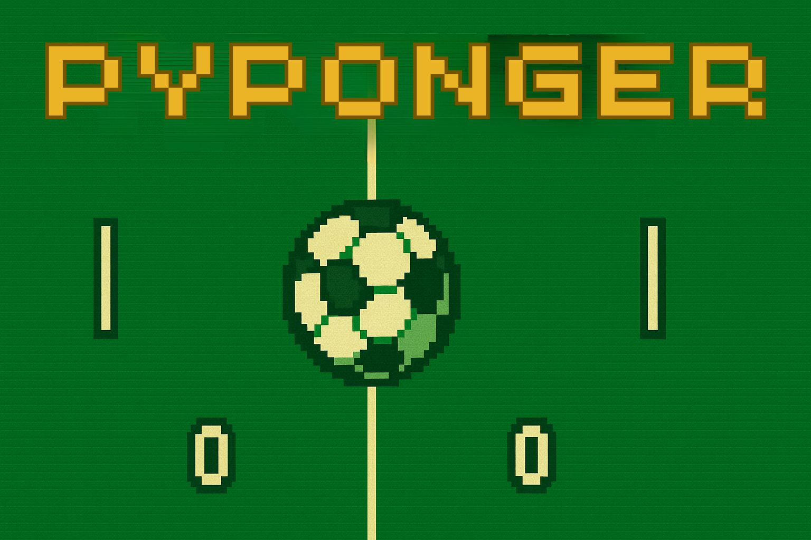

# PyPonger - Fußball Pong

Ein spannendes Fußballspiel, das wie das klassische Pong funktioniert! Spiele gegen einen Freund oder eine einfache KI und versuche, den Ball ins gegnerische Tor zu schießen.

**Entwickelt von Jan Heiko Wohltmann, 2025**  
**Version 0.15 vom 03.09.2025**



## 📋 Projekt-Info


## 📄 Lizenz

Dieses Projekt steht unter der MIT-Lizenz. Siehe [LICENSE](LICENSE) für weitere Details.

## Installation

1. Stellen Sie sicher, dass Python 3.6+ installiert ist
2. Installieren Sie die Abhängigkeiten:
   ```bash
   pip install -r requirements.txt
   ```
3. Optional: Fügen Sie eine Musikdatei hinzu für Hintergrundmusik (unterstützte Formate: .mp3, .wav, .ogg)
   - `background_music.mp3`
   - `music.mp3`
   - `background.wav`
   - `music.wav`
   - `background.ogg`
   - `music.ogg`

4. **Sound-Effekte sind bereits enthalten!** Alle benötigten Sounds befinden sich im `sounds/` Verzeichnis.

## Spielstart

```bash
python pyponger.py
```

## Steuerung

Gamepads können im Hauptmenü konfiguriert und zusätzlich zur Tastatur verwendet werden.

### Einzelspieler (Blau):
- **Torwart & Stürmer**: **Pfeiltaste oben** / **Pfeiltaste unten**
- **Horizontale Bewegung**: **Pfeiltaste links** / **Pfeiltaste rechts**

### Multiplayer:
**Team Links (Blau):**
- **Torwart & Stürmer**: **W** (oben) / **S** (unten)
- **Horizontale Bewegung**: **A** (links) / **D** (rechts)

**Team Rechts (Rot):**
- **Torwart & Stürmer**: **Pfeiltaste oben** / **Pfeiltaste unten**
- **Horizontale Bewegung**: **Pfeiltaste links** / **Pfeiltaste rechts**

### Allgemein:
- **1**: Singleplayer im Hauptmenü
- **2**: Multiplayer im Hauptmenü
- **R**: Neustart (nach Spielende)
- **Q**: Beenden (nach Spielende)

## Spielregeln

- Der Ball prallt von den Spielern und den oberen/unteren Wänden ab
- **Tor-Kollision**: Wenn der Ball die Torpfosten trifft, prallt er ab
- Nur wenn der Ball durch das Tor geht, erhält das gegnerische Team einen Punkt
- Das erste Team, das 5 Punkte erreicht, gewinnt das Spiel
- Der Ball wird nach jedem Tor in der Mitte neu gestartet
- Die Ballrichtung wird durch die Trefferposition auf dem Spieler beeinflusst
- **4 Spieler**: Jedes Team hat einen Torwart und einen Stürmer (Stürmer im gegnerischen Feld)

## Liga-Modus

- Wähle im Hauptmenü den Liga-Modus und lege bis zu 16 Spieler mit Namen an.
- Die Spieler treten nacheinander in 2-minütigen Matches gegeneinander an.
- Vor jedem Match müssen beide Spieler ihre Bereitschaft bestätigen.
- Eine Tabelle hält die Ergebnisse fest.

## Features

- 🏟️ Realistisches Fußballfeld-Design mit Linien und höheren Toren
- 🏁 Eckfahnen für authentisches Aussehen
- ⚽ Gelber Fußball mit schwarzem Muster
- 📊 Punkteanzeige für beide Teams
- 🎮 4-Spieler-Steuerung (Torwart + Stürmer pro Team)
- 🎮 Gamepad-Unterstützung mit konfigurierbaren Belegungen
- 🏆 Multiplayer Liga-Modus mit bis zu 16 Spielern und 2-minütigen Matches
- 👤 **Einzelspieler-Modus** mit KI-gesteuertem Gegner
- 🤖 **Verbesserte Torwart-KI** im Einzelspieler-Modus
- ⚡ **Verbesserte Ballphysik** mit zunehmender Geschwindigkeit
- 🔊 **Vollständiges Sound-System** mit Effekten für Kollisionen und Tore
- 🎵 **6 verschiedene Sound-Effekte** im `sounds/` Verzeichnis
- ↔️ Spieler können sich leicht nach links und rechts bewegen
- 🌱 Streifenmuster auf dem Spielfeld für mehr Atmosphäre
- 🥅 Torpfosten-Kollision: Ball prallt ab, wenn er nicht ins Tor trifft
- 🏆 Gewinner-Anzeige und Neustart-Funktion
- 🎧 **Hintergrundmusik-Unterstützung** für MP3, WAV und OGG

Viel Spaß beim Spielen! ⚽
